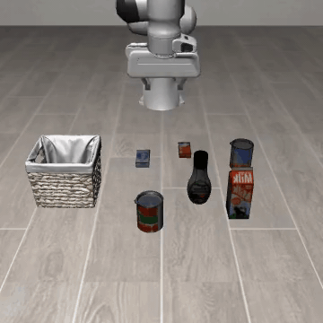
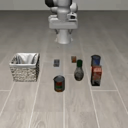
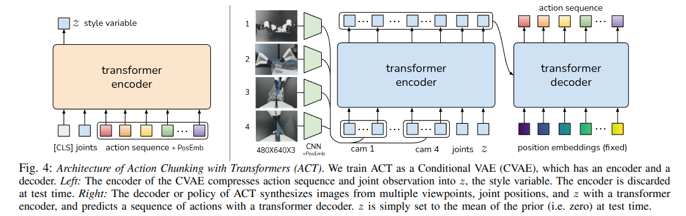
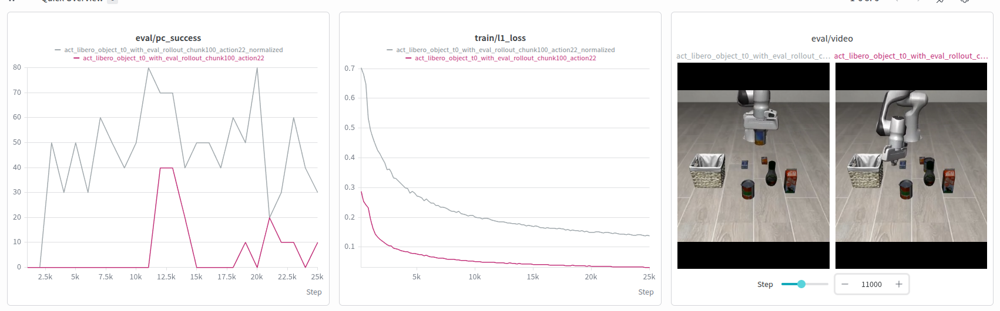
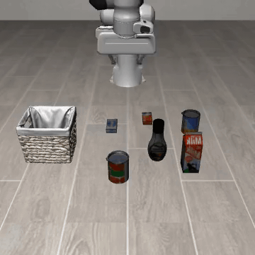

# 1. Train ACT on a single LIBERO task

## Why a single task

The underlying question I'm interested in: how far can a policy that has **no language model in it at all** get, using nothing but demonstrations? Not "understand an instruction and act on it" — just "watch enough demonstrations of a behavior and reproduce it." Simulation is the practical way to run that experiment cheaply and repeatably, so I picked [LIBERO](https://libero-project.github.io/main.html) as the benchmark.

The catch: LIBERO's suites bundle many tasks together, and each demonstration is paired with a language instruction that tells you which object to interact with — e.g. `libero_object` alone covers picking up several different grocery items, disambiguated only by their description ("pick up the alphabet soup", "pick up the tomato sauce", ...). A policy with no way to read that instruction has no signal to tell those episodes apart at training time; it would just see the same scene leading to different, contradictory actions.

This isn't hypothetical — I trained ACT on the full multi-object `libero_object` suite with no language conditioning to check, and this is what it does:



It doesn't fail cleanly. It hovers indecisively over the middle of the scene, never committing to any one object, and ends the episode having placed nothing in the basket. That's not a lack of capability, it's mode collapse: with several equally-valid-looking demonstrations for the same scene disagreeing on which object to grab, and no signal to tell them apart, the policy's least-bad option is to average across them — which produces motion that resembles all of the demonstrations and commits to none. The multimodality of the demonstration set is exactly what a language-free policy can't resolve.

So the fix is to remove the variability the policy can't resolve: extract a subset of one LIBERO task where the *same single object* is picked every time. With no competing targets, the policy can learn "which object" purely from the demonstration distribution itself, no language needed. That's what [`push_libero_subset.py`](push_libero_subset.py) does — it pulls one `(suite, task_id)` out of `lerobot/libero` and rebuilds it as its own standalone dataset.

## Dataset

**[`ssabats/libero_object_task0`](https://huggingface.co/datasets/ssabats/libero_object_task0)** — 44 episodes / 6,867 frames, `libero_object` suite, task 0. Browsable directly: [visualize episode 0](https://huggingface.co/spaces/lerobot/visualize_dataset?path=%2Fssabats%2Flibero_object_task0%2Fepisode_0).

### How it was built

[`push_libero_subset.py`](push_libero_subset.py) is a general-purpose tool, not a one-off script for this task specifically — it resolves any LIBERO `(suite, task_id)` pair (or an exact task-language string, or an explicit list of episode indices) to the matching episodes inside `lerobot/libero`, then physically rebuilds just those episodes as their own standalone, re-indexed `LeRobotDataset` via `split_dataset()`. "Physically" matters here: it's not a filtered view over the full dataset, it's a real, self-contained copy — frames, videos, and episode/task metadata all renumbered from zero — so it trains, evaluates, and pushes to the Hub like any other dataset. This run's dataset was produced with:

```bash
python push_libero_subset.py \
  --new-repo-id ssabats/libero_object_task0 \
  --suite-task libero_object 0 \
  --push
```

Swap `--suite-task libero_object 0` for any other `(suite, task_id)` — e.g. `libero_spatial 3` — to carve out a different single-task subset the same way.

Requires one small fix on top of stock `lerobot`: `split_dataset()` assumes per-episode metadata columns that `lerobot/libero` doesn't have, since it was bulk-converted from an older dataset format. Patched in [`StefanoS90/lerobot@92f4b0f`](https://github.com/StefanoS90/lerobot/commit/92f4b0f3abc3ecf6e059a66d29d9170f36f494ea), branch `libero-subset-fixes`, until it lands upstream.

What the task actually looks like:



## Policy: ACT

[ACT](https://tonyzhaozh.github.io/aloha/) (Action Chunking Transformer) — a CVAE-conditioned transformer that consumes both camera views plus proprioceptive state, and predicts a short *sequence* of future actions in a single forward pass rather than one action at a time.



*Fig. from [Zhao et al.](https://tonyzhaozh.github.io/aloha/), the original ACT paper. Left: the CVAE encoder — only used at train time — compresses the joint state and ground-truth action sequence into a style variable `z`. Right: the policy itself synthesizes the multi-camera images, joint positions, and `z` through a transformer encoder, then a transformer decoder predicts the action sequence. At test time `z` is just fixed to the prior's mean (zero), since there's no ground-truth sequence to encode.*

## Training

```bash
lerobot-train \
  --policy.type=act \
  --dataset.repo_id=ssabats/libero_object_task0 \
  --dataset.video_backend=torchcodec \
  --dataset.eval_split=0.1 \
  --eval_steps=1000 \
  --env.type=libero \
  --env.task=libero_object \
  --env.task_ids='[0]' \
  --env_eval_freq=1000 \
  --eval.n_episodes=10 \
  --eval.batch_size=1 \
  --policy.chunk_size=100 \
  --policy.n_action_steps=22 \
  --output_dir=./outputs/train/act_libero_object_t0_25000_eval_rollout_chunk100_action22 \
  --job_name=act_libero_object_t0_with_eval_rollout_chunk100_action22 \
  --policy.device=cuda \
  --policy.push_to_hub=false \
  --steps=25000 \
  --batch_size=8 \
  --wandb.enable=true \
  --wandb.project=lerobot-libero \
  --save_freq=1000
```

📈 [Run on W&B](https://wandb.ai/stefano-sabatini90-personal/lerobot-libero/runs/2jilokfg)

`--eval_steps=1000 --env_eval_freq=1000 --eval.n_episodes=10 --eval.batch_size=1` interleave training with actual closed-loop rollouts in the LIBERO simulator every 1,000 steps — not just the training loss, an honest success rate, checked continuously *during* training rather than only after the fact from a single checkpoint at the end.

The two parameters that matter most here are `chunk_size` and `n_action_steps`:

- **`chunk_size` (100)** — the *prediction horizon*: how many future actions the decoder predicts in one forward pass.
- **`n_action_steps` (22)** — the *execution horizon*: how many of those predicted actions are actually run open-loop before the policy is queried again with a fresh observation.

Action chunking exists to fight compounding error. A policy queried at every single step is cheap to correct but drifts easily; a policy that commits to one giant open-loop action sequence saves compute but has nothing to fall back on once the robot drifts even slightly outside the states its training data actually covers — small errors compound because the policy has never seen how to recover from them. Predicting a long chunk (100 steps of headroom) but only ever committing to a much shorter slice of it (22 steps, roughly one second at 20 Hz) is the middle ground: mostly-open-loop execution for efficiency, with a re-plan against the real, current observation before drift can compound too far.

## Normalization matters more than either of those

The dataset originally shipped without any recorded action/state statistics, which — silently, no error — disabled `MEAN_STD` normalization for both during training. Retraining the identical config after fixing the dataset's statistics gives a very different curve:



Same architecture, same hyperparameters, same 25k steps — the only difference is whether `action`/`observation.state` were actually normalized. The normalized run's training loss drops several times faster and settles far lower, and its eval success rate reaches 70–80% by ~11k steps where the un-normalized run mostly sits at 0% and only briefly touches 40%.

Concretely: with normalization actually working, the policy crosses **80% success in well under 30 minutes** of training on a single GPU — for a 44-episode dataset and a policy with no language conditioning at all, that's a fast, cheap loop to iterate in.

## Eval rollouts

A clean success:



A rollout that drifts off-plan but recovers — this is what the 22-step re-plan cadence buys you: the policy re-observes roughly once a second and corrects, rather than committing blindly to the full 100-step chunk:


