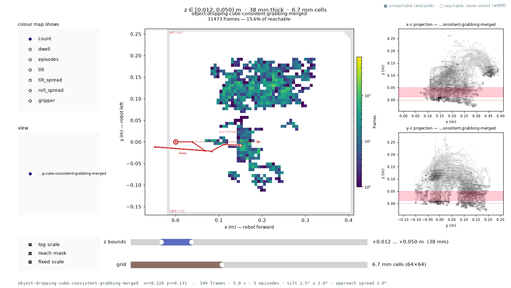
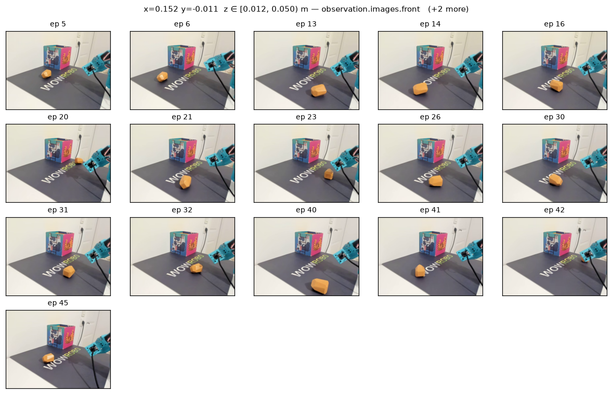
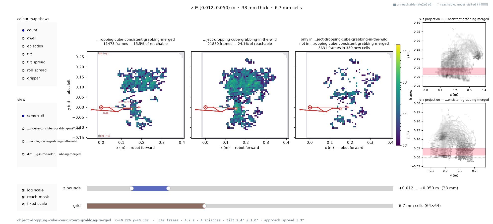

# Visualising end-effector workspace coverage

I have been recording SO-101 episodes for a "grab the cube, drop it in the box" task and
merging them into bigger and bigger datasets. The obvious question before training on one
is *what does this dataset actually cover*.

The Hugging Face viewer will replay any of them — here is
[episode 0 of `object-dropping-cube-consistent-grabbing-merged`](https://huggingface.co/spaces/lerobot/visualize_dataset?path=%2Fssabats%2Fobject-dropping-cube-consistent-grabbing-merged%2Fepisode_0).
It is the right tool for checking that an episode looks sane: the camera feeds, the state
and action traces, frame by frame.

What it cannot tell me is where in the workspace those 60 episodes have *collectively*
been. It shows one episode at a time, and it shows joint angles, not the gripper's position
in space. Joint statistics do not answer it either — knowing a motor swept 130° says
nothing about whether the gripper ever reached the far side of the table, or whether it
only ever arrived there from one angle.

That is what this tool is for: every frame of every episode, run through forward kinematics,
binned in Cartesian space, with a slider to walk up through the workspace height by height.

## One dataset



The main panel is a top-down x–y map of one horizontal slab of the workspace — here
`z ∈ [0.012, 0.050)` m, a 38 mm slice just above the table. The robot is drawn at the
origin with a pale arrow along the direction it faces, so it is always obvious which side
of the arm the data is on.

Three states are distinguished, which is the point of the whole exercise:

- **grey** — the arm physically cannot reach this cell at this height
- **white** — reachable, but this dataset never went there
- **colour** — visited, shaded by how many frames

Without the grey, a coverage percentage would be meaningless: you would be measuring
against a bounding box rather than against what the arm can actually do. Here 11,473 frames
land in this slab and cover **15.6% of the reachable area** — and across all six slices of
the workspace the figure peaks at 17.2%.

The shape is as informative as the number. Almost everything sits on the robot's left
(+y) in a blob around y ≈ 0.10–0.20, plus a cluster near the base where the arm parks
between episodes. The entire right-hand side of the reachable workspace is white.

The two sliders redraw continuously: **z bounds** sets both edges of the slab, **grid**
changes the cell size. Hovering a cell reports its numbers in the status line at the bottom.

Clicking one goes further: it lists the episodes that passed through that cell and pops up
each of their opening camera frames.



That is what turns a heatmap into an explanation. Eighteen episodes pass through this one
cell just in front of the base — and the cube sits somewhere different in every frame, so
the cell is where the arm parks between episodes, not anything the task put there. Cells
further out tell the opposite story: the same cube position in frame after frame, because
that is exactly where the cube was.

## Comparing two datasets

Pass more than one `repo_id` and the window opens in comparison mode: one panel per
dataset plus the diff, on shared axes and a shared colour scale.



This is the layout that answers *what did this recording session actually add*. The third
panel is the diff — `B \ A`, the cells B visited that A never did — recomputed as you move
either slider.

Against the 146-episode `object-dropping-cube-grabbing-in-the-wild`, the smaller set's
15.5% becomes 24.1%, and the diff isolates exactly what is new: **3,631 frames in 330 cells**.
Reading where they fall matters more than the count — they are not a rim around the
existing blob, they are scattered through the middle *and* down into the y < 0 half that
`consistent-grabbing-merged` barely touched. Neither of the first two panels tells you that
on its own.

An empty diff panel is an answer rather than a bug: the direction matters, and the panel
says so explicitly and prints the flag to flip it.

## Running it

Everything runs against the sibling `lerobot` checkout's environment and adds no dependency.

```bash
cd 02-ee-workspace-coverage
L=../../lerobot   # or wherever your lerobot checkout is

# One dataset.
uv run --project $L python ee_coverage.py \
    ssabats/object-dropping-cube-consistent-grabbing-merged \
    --interactive --z-bounds 0.012,0.050 --bins 64 --log

# Two datasets: adds per-dataset panels and a "B \ A" entry showing what B added.
uv run --project $L python ee_coverage.py \
    ssabats/object-dropping-cube-consistent-grabbing-merged \
    ssabats/object-dropping-cube-grabbing-in-the-wild \
    --interactive --z-bounds 0.012,0.050 --bins 64 --log

# Static figures + summary.txt instead of a window.
uv run --project $L python ee_coverage.py \
    ssabats/object-dropping-cube-consistent-grabbing-merged \
    --z-slices 6 --bins 64 --panel-color count --log --out-dir assets/
```

`--panel-color` also takes `dwell`, `episodes`, `tilt`, `tilt_spread`, `roll_spread` and
`gripper`; `--source action` bins the commanded pose rather than the measured one; `--rerun`
opens a 3D aggregate view instead. `python so101_fk.py --self-test` checks the kinematics
before you trust any of it.

## Files

- `so101_fk.py` — URDF fetch, chain parsing, batched forward kinematics, joint-limit sampling.
- `ee_coverage.py` — dataset loading, joint-unit handling, and the binning model.
- `coverage_render.py` — static PNG export and the rerun 3D view.
- `coverage_viewer.py` — the interactive window.
- `episode_frames.py` — decodes each episode's opening camera frame for the click pop-up.
