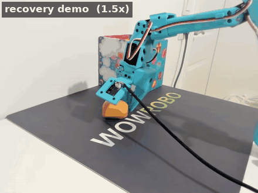
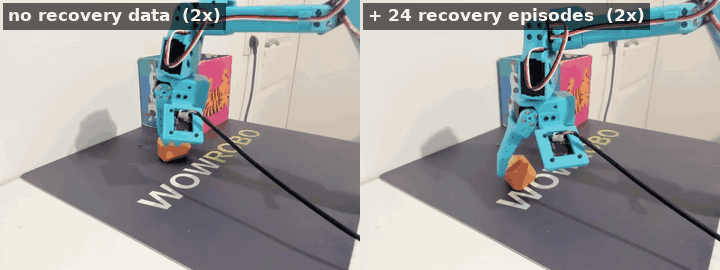

# 3. Lessons from a real robot: SO-101

Chapters 1 and 2 ran in simulation and on recorded data. This chapter is what I learned
recording, training and rolling out policies on a real SO-101 arm:

1. **When the policy misbehaves, change the data** — recovery episodes on a single task (ACT).
2. **Language: one model, several tasks** — SmolVLA on a five-task dataset. *(coming next)*
3. **Inference with RTC** — reacting fast vs committing. *(coming next)*

## 1. When the policy misbehaves, change the data

When a rollout goes wrong, the first question is not *"what is wrong with the model?"* but
*"which situation is this that the data never showed?"*. An imitation policy can only reproduce
its demonstrations; when it does something silly it has usually reached a state none of them
covered. The fix is to record that state.

**Task:** *"Grab the object and drop it inside the cube"*: pick up the orange piece and drop it
in the box behind it. ACT, front and wrist cameras, 30 fps.

### The failure: stuck next to the object

My first 60 demonstrations
([`…consistent-grabbing-merged`](https://huggingface.co/datasets/ssabats/object-dropping-cube-consistent-grabbing-merged))
were clean: same approach, same grasp, and it worked first time in every episode. The policy
trained on them reaches the object fine, but when a grasp misses it never tries again. It
hovers beside the object with the gripper half open, for over a minute.

That is not a broken model. No demonstration ever missed, so *"gripper beside the object,
nothing in it"* simply is not in the data, and neither is the way out of it.

### The fix: recovery episodes

I recorded 24 episodes that *start* in failure: arm placed by hand beside the object, shifted
sideways or half on top of it, then backing off, re-centring and grasping
([`…recovery`](https://huggingface.co/datasets/ssabats/object-dropping-cube-consistent-grabbing-recovery_20260911_174132),
[`…recovery-2`](https://huggingface.co/datasets/ssabats/object-dropping-cube-consistent-grabbing-recovery-2_20260911_174936),
[`…search-mode`](https://huggingface.co/datasets/ssabats/object-dropping-cube-consistent-grabbing-search-mode_20260911_175816)).
Here is episode 2 of `recovery-2`: it starts pressing on the object off-centre, backs off,
comes back from above and grasps.

### The result

The two models differ only in the training data: the same 60 episodes, plus the 24 recovery
episodes on the right. Both clips start right after a missed grasp.

The right-hand model still misses sometimes. What changed is what happens next: it lifts off,
re-centres, grasps again and drops the object in the box.

One surprise: in the [chapter 2 coverage viewer](../02-ee-workspace-coverage/README.md) the
recovery episodes add only about 3% new workspace cells. They don't take the gripper anywhere
new. They show familiar places in an unfamiliar *situation* (misaligned, empty-handed) together
with the action that fixes it, and a map of positions cannot show that.

### Takeaways

- **A failing rollout is a question about the data.** Find the state it got stuck in, then
  ask whether any demonstration ever went through it.
- **Demonstrations that always succeed hide failure states.** On a real robot mistakes will
  happen, so the data has to show what to do after one.
- **Recovery episodes are cheap.** 24 short episodes turned a policy that froze into one that
  retries until it succeeds.
