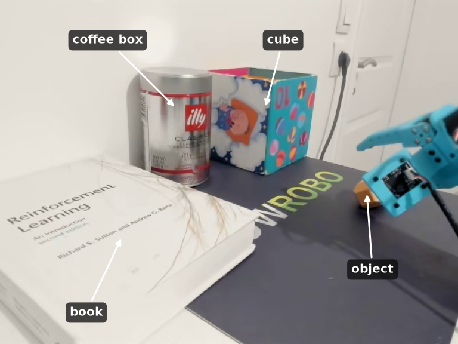
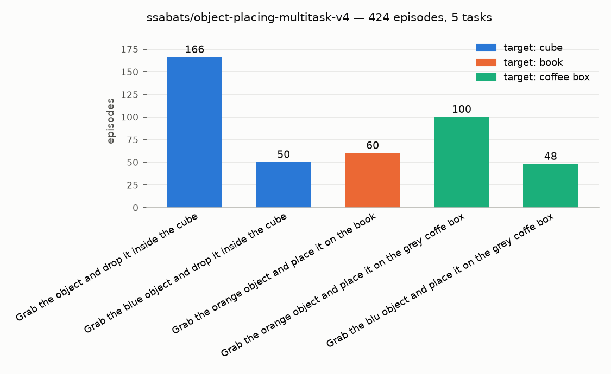
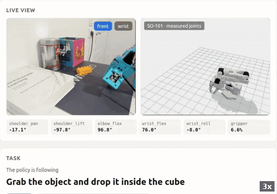

# 4. Language: one model, several tasks

ACT is a single-task policy. It maps what it sees (camera images and joint positions) to
actions, and nothing else: there is no input that says *which* task to do. With one task that
is all it needs. Put several tasks in the same scene, though, and the same observation calls
for different actions depending on the task. ACT cannot tell those episodes apart and averages
them, which is the indecisive hovering from
[chapter 1](../01-train-act-on-libero-object/README.md#why-a-single-task).

A vision-language-action model (VLA) adds the missing input: a text instruction. The language
model encodes the instruction and the action head is conditioned on it, so the same scene with
a different sentence gives a different behaviour. Here I use
[SmolVLA](https://huggingface.co/lerobot/smolvla_base), which is small enough to fine-tune on
one GPU and to run on my laptop.

## The workspace

Three targets share the table: the patterned box (*"the cube"*), the book, and the coffee can
(*"the grey coffee box"*). The object to move is either orange or blue.

## The dataset

[`ssabats/object-placing-multitask-v4`](https://huggingface.co/datasets/ssabats/object-placing-multitask-v4):
424 episodes over five instructions, merged from single-task sessions recorded over three
weeks. Each task appears in the dataset with its exact sentence, and that sentence is what the
policy is conditioned on.

The cube task is the largest because it carries all the earlier data, recovery episodes
included. The [chapter 2 coverage viewer](../02-ee-workspace-coverage/README.md#multitask-datasets)
can filter this dataset by task, to check what each task covers on its own.

## Switching the task on the fly

To test the conditioning I wrote a small web app on top of `lerobot-rollout`
([`live_task_switcher/`](live_task_switcher/README.md)). It loads the
fine-tuned SmolVLA checkpoint, runs it on the arm, and lets me change the instruction while the
policy is running, with no restart (inference uses RTC).

In the clip below (3x) the policy drops the brick into the cube. I switch the instruction to
the book, put the brick back on the mat, and it places it on the book. Then I switch to the
coffee box while the arm is already reaching for the brick, and it places it on the coffee
can instead. The weights and the scene stay the same; only the sentence changes.

## Takeaways

- **No task input, no multitask.** A policy without conditioning can only learn one behaviour
  per scene; language is the conditioning signal that lets one model hold several.
- **The instruction is part of the data.** The policy is conditioned on the sentences it saw
  in training (the app offers exactly those), so every task needs its own sentence and enough
  episodes to go with it.
- **The data lessons carry over.** The multitask dataset is built from the same single-task
  sessions, recovery episodes included ([chapter 3](../03-data-before-model/README.md)); the
  VLA does not remove the need for good data.
