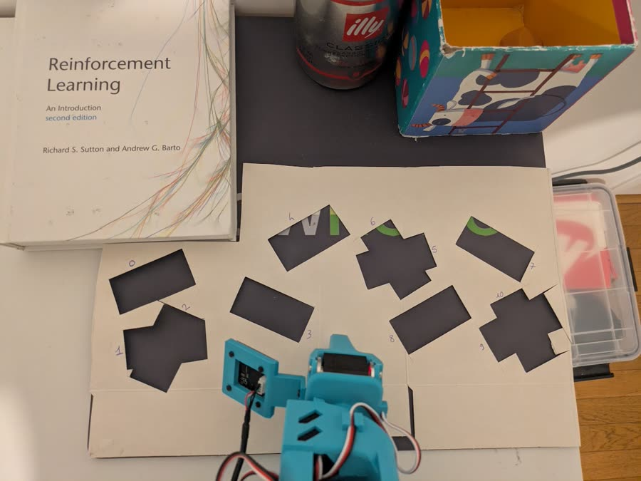
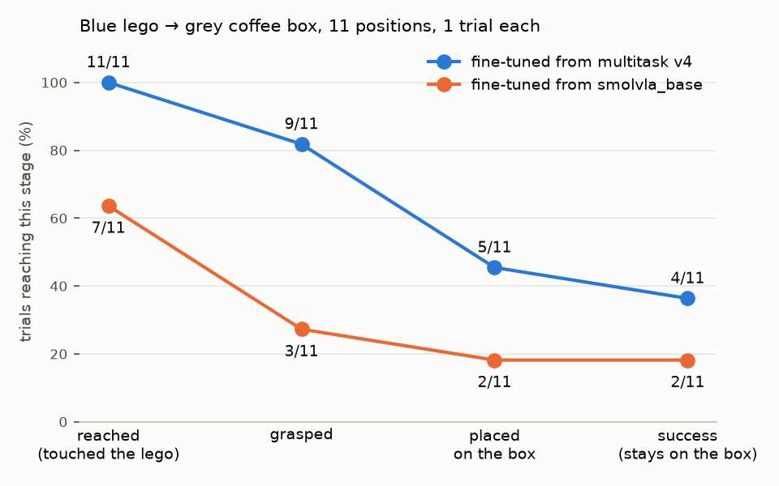
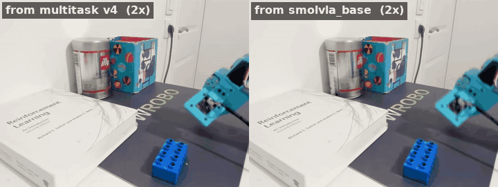
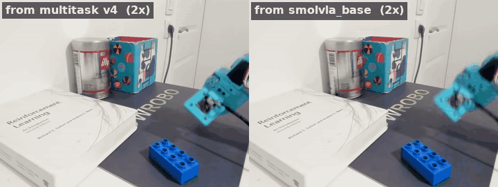
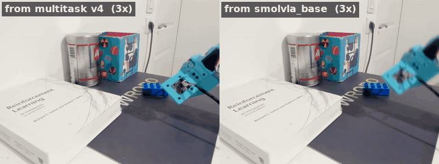

# 5. Does multitask pretraining help a single task?

Say you only care about one task: put the blue lego on the grey coffee box. Is it worth
starting from a policy trained on *other* tasks first, or should you simply fine-tune the
pretrained SmolVLA from Hugging Face on your 48 demonstrations? I ran an A/B evaluation on the
real arm to find out.

## The two recipes

Both policies are fine-tuned on the same dataset
([`object-blu-lego-placing-coffe-box_20260928_165620`](https://huggingface.co/datasets/ssabats/object-blu-lego-placing-coffe-box_20260928_165620),
48 episodes) for the same 25k steps. They differ only in where fine-tuning starts:

| | Starts from | Then fine-tuned on |
|---|---|---|
| **From multitask v4** | the [chapter 4](../04-language-multitask/README.md) policy: SmolVLA trained on [`object-placing-multitask-v4`](https://huggingface.co/datasets/ssabats/object-placing-multitask-v4) (424 episodes, 5 tasks) | blue lego → coffee box |
| **From smolvla_base** | the base SmolVLA checkpoint from Hugging Face, [`lerobot/smolvla_base`](https://huggingface.co/lerobot/smolvla_base) | blue lego → coffee box |

One thing to be clear about: multitask v4 already contains these 48 episodes, as one of its
five tasks. So this experiment asks whether a prior that has seen the task *alongside four
others* does better than learning the task alone. Whether the benefit survives when the target
task is left out of pretraining is the next experiment.

## The evaluation

I used 11 fixed lego positions, the same for both policies, with one trial per position and
policy. To place the lego in exactly the same spot for both policies, I used a cardboard
stencil with 11 numbered holes, registered on the mat. Before each trial I dropped the lego into
the hole for that position and lifted the stencil away, so the policy never sees it. Holes 1/2,
5/6 and 9/10 share a spot with two different rotations.

Each trial is scored in stages, so a near miss is distinguishable from a policy that never
gets close:

- **Reached**: the gripper touched the lego
- **Grasped**: the lego lifted in the gripper
- **Placed**: released on the coffee box
- **Success**: still resting on the box at the end

Both policies ran with the same `lerobot-rollout` settings: episodic strategy, RTC with
execution horizon 20 and queue threshold 30, and a 45 s limit per episode. The raw scores are
in [`coffebox_ab_eval(Evaluation).csv`](coffebox_ab_eval%28Evaluation%29.csv).

## Results

The policy fine-tuned from multitask v4 is ahead at every stage. The biggest gap is early: it
touches the lego in every trial and grasps it in 9 of 11, while the one fine-tuned from
`smolvla_base` misses the lego entirely in 4 trials and grasps it only 3 times. Final
success is 4/11 against 2/11.

With 11 trials per policy, none of these gaps is statistically significant on its own. An exact
McNemar test on the paired positions gives p ≈ 0.07 for grasping (7 positions where only the
multitask fine-tune grasped, 1 the other way round) and p ≈ 0.6 for success. So read this as a
consistent direction, not as proof; the second repetition of every position is still to be run.

## Same position, two policies

### When the first grasp works

**Position 1.** Both policies grasp the lego and place it on the box in a similar time.

### When the first grasp fails: two recoveries

In these two positions both policies get the first approach wrong. Only the one fine-tuned
from multitask v4 recovers.

**Position 2.** The multitask fine-tune needs three tries, then grasps the lego and places it
on the box. The `smolvla_base` fine-tune reaches the lego and keeps nudging it, but never
closes the gripper on it, and the lego stays on the mat.

**Position 6.** The multitask fine-tune misses four times, with the lego getting pushed and
tipped, but keeps going back to it. After about 30 s it grasps the lego and places it on the
box. The `smolvla_base` fine-tune knocks the lego over within the first few seconds, then
hovers away from it and never tries again. (The right-hand clip is shorter; its last frame is
held.)

These two recoveries are half of the multitask fine-tune's four successes. The `smolvla_base`
fine-tune retried once (position 5), but whenever its first approach went wrong it almost never
ended up succeeding.

## Why this might happen

This is a hypothesis, not something this evaluation proves. The multitask policy was trained on
424 episodes across five tasks, including the recovery episodes from
[chapter 3](../03-data-before-model/README.md) and many approaches to objects in different
places. "Approach the object, and if the grasp misses, go back and try again" is a skill shared
by all five tasks, so it gets learned from far more data than the 48 episodes of one task can
provide. Fine-tuning then specialises that skill to the blue lego and the coffee box. A policy
fine-tuned from `smolvla_base` has only those 48 episodes, mostly clean first-time grasps, so it
has rarely seen what to do after a miss.

## Caveats

- **11 trials per policy, one repetition.** A consistent direction, but not significant yet.
- **The prior has seen the target task.** Multitask v4 includes these 48 episodes, so this
  measures "the task plus four others" against "the task alone", not transfer to a new task.
- **Not blind.** I knew which policy was running while scoring.

## Takeaways

- **Pretraining on other tasks helped even for a single task.** The multitask fine-tune
  reached, grasped and completed more often from the same 11 starting positions.
- **The difference shows up most after a mistake.** Both policies can succeed when the first
  grasp works; the multitask fine-tune is the one that keeps trying until it does.
- **Evaluate task completion in stages, not just success.** Scoring reaching, grasping and
  placing separately tells you much more than a success rate alone. "Grasped 9/11" is a far
  more telling result than "succeeded 4/11": it shows the multitask fine-tune gets hold of the
  lego almost every time and loses most trials later, at the place, while the base fine-tune
  (3/11) already fails at the grasp. A single success rate hides where each policy breaks,
  and so what to fix next.
