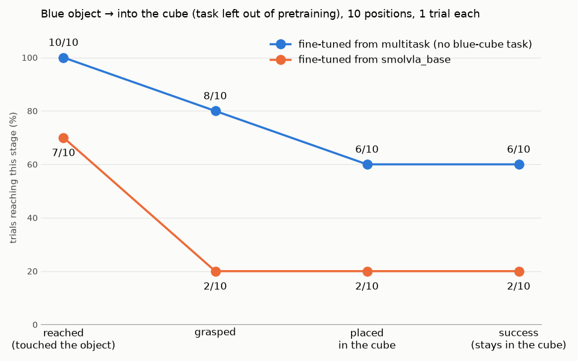
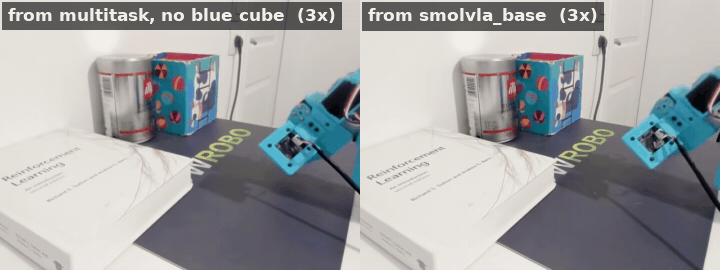

# 5. Does multitask pretraining help a single task?

Say you only care about one task. Is it worth starting from a policy trained on *other* tasks
first, or should you simply fine-tune the pretrained SmolVLA from Hugging Face on your
demonstrations? I ran two A/B evaluations on the real arm to find out, on two different target
tasks:

1. **Blue lego → grey coffee box.** The target task is one of the tasks in the multitask
   pretraining.
2. **Blue object → into the cube.** The target task is **left out** of the multitask
   pretraining.

## Setup

### Two recipes

For each task, two policies are fine-tuned on the same single-task dataset for the same number
of steps. They differ only in where fine-tuning starts:

- **From multitask**: a SmolVLA policy first trained on the multitask dataset of
  [chapter 4](../04-language-multitask/README.md),
  [`object-placing-multitask-v4`](https://huggingface.co/datasets/ssabats/object-placing-multitask-v4)
  (424 episodes, 5 tasks), or a version of it with the target task removed.
- **From smolvla_base**: the base SmolVLA checkpoint from Hugging Face,
  [`lerobot/smolvla_base`](https://huggingface.co/lerobot/smolvla_base).

The exact recipes are listed with each task below.

### Evaluation protocol

Each policy runs once from each of a set of fixed object positions, the same for both policies.
To place the object in exactly the same spot for both policies, I used a cardboard stencil with
11 numbered holes, registered on the mat. Before each trial I dropped the object into the hole
for that position and lifted the stencil away, so the policy never sees it. Holes 1/2, 5/6 and
9/10 share a spot with two different rotations.

Each trial is scored in stages, so a near miss is distinguishable from a policy that never
gets close:

- **Reached**: the gripper touched the object
- **Grasped**: the object lifted in the gripper
- **Placed**: released on the target (the coffee box, or into the cube)
- **Success**: still on or in the target at the end

All policies ran with the same `lerobot-rollout` settings: episodic strategy, RTC with
execution horizon 20 and queue threshold 30.

## Task 1: blue lego → grey coffee box (in the pretraining)

### Recipes

Both policies are fine-tuned for 25k steps on
[`object-blu-lego-placing-coffe-box_20260928_165620`](https://huggingface.co/datasets/ssabats/object-blu-lego-placing-coffe-box_20260928_165620)
(48 episodes).

| | Starts from | Then fine-tuned on |
|---|---|---|
| **From multitask v4** | the [chapter 4](../04-language-multitask/README.md) policy, trained on all of multitask v4 (424 episodes, 5 tasks) | blue lego → coffee box, 25k steps |
| **From smolvla_base** | [`lerobot/smolvla_base`](https://huggingface.co/lerobot/smolvla_base) | blue lego → coffee box, 25k steps |

Multitask v4 already contains these 48 episodes, as one of its five tasks. So this task asks
whether a prior that has seen the task *alongside four others* does better than learning the
task alone.

### Results

11 positions, one trial each, 45 s limit per episode. Raw scores:
[`coffebox_ab_eval(Evaluation).csv`](coffebox_ab_eval%28Evaluation%29.csv).

The policy fine-tuned from multitask v4 is ahead at every stage. The biggest gap is early: it
touches the lego in every trial and grasps it in 9 of 11, while the one fine-tuned from
`smolvla_base` misses the lego entirely in 4 trials and grasps it only 3 times. Final
success is 4/11 against 2/11.

With 11 trials per policy, none of these gaps is statistically significant on its own. An exact
McNemar test on the paired positions gives p ≈ 0.07 for grasping (7 positions where only the
multitask fine-tune grasped, 1 the other way round) and p ≈ 0.6 for success. So read this as a
consistent direction, not as proof.

### Side by side

**Position 1.** Both policies grasp the lego and place it on the box in a similar time.

**Position 2.** Both policies get the first approach wrong. The multitask fine-tune needs three
tries, then grasps the lego and places it on the box. The `smolvla_base` fine-tune reaches the
lego and keeps nudging it, but never closes the gripper on it, and the lego stays on the mat.

**Position 6.** The multitask fine-tune misses four times, with the lego getting pushed and
tipped, but keeps going back to it. After about 30 s it grasps the lego and places it on the
box. The `smolvla_base` fine-tune knocks the lego over within the first few seconds, then
hovers away from it and never tries again. (The right-hand clip is shorter; its last frame is
held.)

These two recoveries are half of the multitask fine-tune's four successes. The `smolvla_base`
fine-tune retried once (position 5), but whenever its first approach went wrong it almost never
ended up succeeding.

## Task 2: blue object → into the cube (left out of the pretraining)

### Recipes

Both policies are fine-tuned for 22k steps on
[`object-blue-dropping-cube_20260925_173530`](https://huggingface.co/datasets/ssabats/object-blue-dropping-cube_20260925_173530)
(50 episodes, *"Grab the blue object and drop it inside the cube"*; the "blue cube" bar of
[chapter 4](../04-language-multitask/README.md)).

| | Starts from | Then fine-tuned on |
|---|---|---|
| **From multitask, no blue cube** | SmolVLA trained for 116k steps on multitask v4 *minus* the 50 blue-cube episodes: 374 episodes, the four other tasks | blue object → cube, 22k steps |
| **From smolvla_base** | [`lerobot/smolvla_base`](https://huggingface.co/lerobot/smolvla_base) | blue object → cube, 22k steps |

This time the pretraining never sees the blue object going into the cube. What it does see is
a different object (the orange one) going into the same cube, 166 times, and the same blue
object going onto the coffee box. So the target task is new as a combination, but each half of
it appears somewhere in the pretraining.

### Results

10 positions, one trial each. Raw scores:
[`blue_cube_ab_eval(Evaluation).csv`](blue_cube_ab_eval%28Evaluation%29.csv).

The gap is as large as in task 1, and larger at the end: **6/10 against 2/10** success. The
pattern is the same. The multitask fine-tune touches the object in every trial and grasps it in
8; the `smolvla_base` fine-tune misses the object in 3 trials and grasps it only twice
(positions 0 and 1, both of which it then completes). Once the multitask fine-tune places the
object, it stays in the cube: placed and success are both 6/10. Its four failures are two missed
grasps and two grasps that never made it into the cube.

On the paired positions, grasping is significant on its own: 6 positions where only the
multitask fine-tune grasped, none the other way round, exact McNemar p ≈ 0.03. Success is
5 against 1, p ≈ 0.22.

### Side by side

**Position 9.** The multitask fine-tune misses its first grasps, goes back to the object, and on
the third try lifts it and drops it into the cube. The `smolvla_base` fine-tune moves over the
object and hovers above it, but never goes down to touch it. (The right-hand clip is shorter;
its last frame is held.)

## Interpretation of results

Both tasks point the same way: the policy fine-tuned from a multitask prior reaches and grasps
the object far more often, and the gap is widest after a missed first grasp. The second task
adds that this does not depend on the target task being in the pretraining mix. A prior trained
on *related* tasks (same cube, same blue object, different pairings) is enough.

Why this happens is a hypothesis, not something these evaluations prove. The multitask policy
was trained on hundreds of episodes across several tasks, including the recovery episodes from
[chapter 3](../03-data-before-model/README.md) and many approaches to objects in different
places. "Approach the object, and if the grasp misses, go back and try again" is a skill shared
by all the tasks, so it gets learned from far more data than the ~50 episodes of one task can
provide. Fine-tuning then specialises that skill to the target object and place. A policy
fine-tuned from `smolvla_base` has only those ~50 episodes, mostly clean first-time grasps, so
it has rarely seen what to do after a miss.

## Takeaways

- **Pretraining on other tasks helped even for a single task.** In both tasks the multitask
  fine-tune reached, grasped and completed more often from the same starting positions.
- **The target task does not have to be in the pretraining.** With the blue-cube task removed,
  the multitask fine-tune still succeeded 6/10 against 2/10. Related tasks in the same scene
  were enough.
- **The difference shows up most after a mistake.** Both policies can succeed when the first
  grasp works; the multitask fine-tune is the one that keeps trying until it does.
- **Evaluate task completion in stages, not just success.** Scoring reaching, grasping and
  placing separately tells you much more than a success rate alone. In task 1, "grasped 9/11"
  is a far more telling result than "succeeded 4/11": it shows the multitask fine-tune gets
  hold of the lego almost every time and loses most trials later, at the place, while the base
  fine-tune (3/11) already fails at the grasp. A single success rate hides where each policy
  breaks, and so what to fix next.
